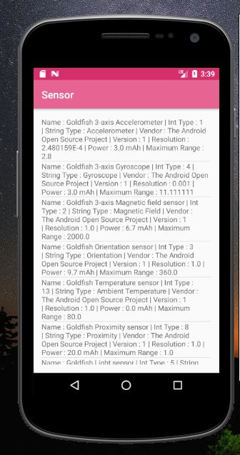
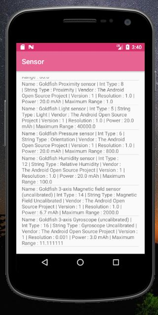

# Sensor Dalam Smartphone Android
Dalam perangkat android memiliki banyak sensor yang dapat digunakan,berikut adalah daftar sensor Android
#

## Sensor ACCELOMETER
__Deskripsi__ : 

Mengukur gaya akselerasi dalam m/s2 yang diterapkan di perangkat pada ketiga sumbu fisik (x, y, dan z), termasuk gaya gravitasi.Sensor ini biasa diterapkan untuk mendeteksi pergerakan seperti shake atau tilt. Penggunaan paling umum dari sensor jenis ini adalah saat layar secara otomatis berubah dari mode potrait ke mode landscape. Atau saat memainkan game jenis balap dimana cara mengemudikannya dengan memiringkan posisi perangkat (tilt).

__Penggunaan__ : 

Deteksi gerakan (goyangan, kemiringan, dll.).

## Sensor AMBIENT TEMPERATURE
__Deskripsi__ : 

Mengukur suhu ruangan sekitar dalam derajat Celcius (°C).

__Penggunaan__ : 

Memantau suhu udara.

## Sensor GRAVITY
__Deskripsi__ : 

Mengukur gaya gravitasi dalam m/s2 yang diterapkan di perangkat pada ketiga sumbu fisik (x, y, z). Sensor ini bekerja mengikuti arah gravitasi dari perangkat yang digunakan secara vertikal dan horisontal. Mirip dengan Accelerometer, tapi sensor tersebut hanya digunakan untuk mendeteksi posisi saja.

__Penggunaan__ : 

Deteksi gerakan (goyangan, kemiringan, dll.).

## Sensor GYROSCOPE
__Deskripsi__ : 

Mengukur tingkat rotasi perangkat dalam rad/s di sekitar setiap tiga sumbu fisik (x, y, dan z). Jika pada accelerometer dipengaruhi oleh gravitasi, maka gyroscope tidak dipengaruhi oleh gravitasi, oleh karena itu gerakan yang dihasilkannya lebih halus dibanding Accelerometer.

__Penggunaan__ : 

Deteksi rotasi (berputar, berbalik, dll.).Sensor ini biasa dimanfaatkan untuk game seperti Temple Run.

## Sensor LIGHT
__Deskripsi__ : 

Mengukur level cahaya sekitar (pencahayaan) dalam lx.

__Penggunaan__ : 

Mengontrol kecerahan layar.
  
## Sensor LINEAR ACCELERATION
__Deskripsi__ : 

Mengukur gaya akselerasi dalam m/s2 yang diterapkan di perangkat pada ketiga sumbu fisik (x, y, dan z), tidak termasuk gaya gravitasi.

__Penggunaan__ : 

Memantau akselerasi sepanjang sumbu tunggal.

## Sensor MAGNETIC FIELD
__Deskripsi__ : 

Mengukur medan geomagnetik sekitar untuk ketiga sumbu fisik (x, y, z) dalam μT.

__Penggunaan__ : 

Membuat kompas.

## Sensor ORIENTATION
__Deskripsi__ : 

Mengukur derajat rotasi yang dibuat perangkat di sekitar ketiga sumbu fisik (x, y, z). Pada API level 3, Anda dapat memperoleh matriks kemiringan dan matriks rotasi untuk perangkat menggunakan sensor gravitasi dan sensor medan geomagnetik bersama dengan metode getRotationMatrix()

__Penggunaan__ : 

Menentukan posisi perangkat.

## Sensor PRESSURE	
__Deskripsi__ : 

Mengukur tekanan udara sekitar dalam hPa atau mbar.

__Penggunaan__ : 

Memantau perubahan tekanan udara.

## Sensor PROXIMITY	
__Deskripsi__ : 

Mengukur kedekatan objek dalam cm sesuai dengan layar tampilan perangkat. Sensor ini biasanya digunakan untuk menentukan apakah suatu handset ditahan di telinga seseorang.

__Penggunaan__ : 

Posisi telepon selama panggilan.

## Sensor RELATIVE_HUMIDITY
__Deskripsi__ : 

Mengukur kelembapan udara relatif dalam persen (%).

__Penggunaan__ : 

Memantau kelembapan relatif, mutlak dan titik embun.

## Sensor ROTATION_VECTOR
__Deskripsi__ : 

Mengukur orientasi perangkat dengan memberikan tiga elemen vektor rotasi perangkat.

__Penggunaan__ : 

Deteksi gerakan dan deteksi rotasi.

## Sensor TEMPERATURE
__Deskripsi__ : 

Mengukur suhu perangkat dalam derajat Celcius (°C). Penerapan sensor ini bervariasi antarperangkat dan sensor ini diganti dengan sensor TYPE_AMBIENT_TEMPERATURE di API Level 14

__Penggunaan__ : 

Memantau suhu.
